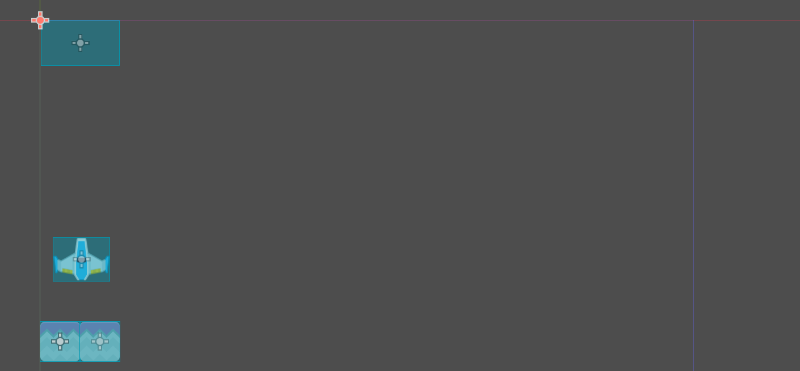
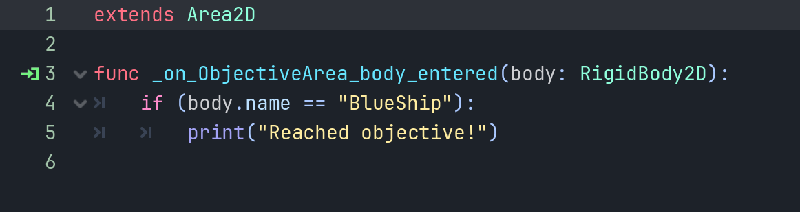
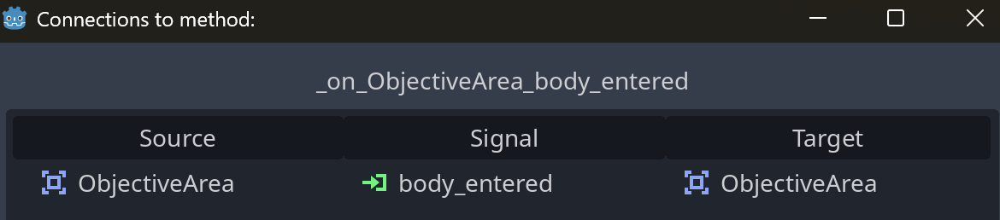
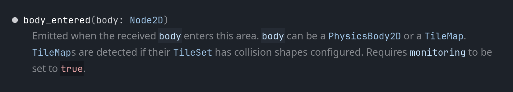
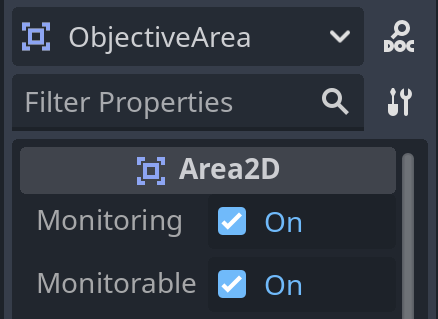

# Tutorial 2 Game Development
Introduction to Game Design  

Nama : Favian Naufal  
NPM  : 2006597802  

## Latihan 1 - Playtest
Dalam melakukan <i>Playtesting</i> dengan menekan tombol <i><b>play</b></i>, pemain dapat menavigasikan objek landasan dengan menggunakan tombol panah atas dan tombol panah bawah. <i>Behavior</i> dari objek landasan tersebut didefinisikan dalam <i>script</i> `PlatformBlue.gd` dalam fungsi `_process()`. Adapun fungsi lain di dalam <i>script</i> yang sama, yaitu `_ready()` yang ter<i>trigger</i> pada saat game tersebut dijalankan, di mana pada kasus ini, keluaran `"Platform initialized"` akan panel <i><b>Output</b></i>.  

Berikut adalah hasil observasi yang di dapatkan dalam latihan ini.
- Apa saja pesan <i>log</i> yang dicetak pada panel <i><b>Output</b></i>?  
  
Seperti yang telah dijelaskan sebelumnya, <i>log</i> yahng berisikan `"Platform initialized"` akan muncul dalam panel <i>Output</i> sebagai penanda bahwa <i>scene</i> yang terpilih akan dimainkan, termasuk dalam <i>debugging</i> dan <i>playtesting</i>, hal ini merupakan bagian dari <i>script</i> `PlatformBlue.gd`, oleh fungsi bernama `_
ready()`.  

- Coba gerakkan landasan ke batas area bawah, lalu gerakkan kembali ke atas hingga hampir menyentuh batas atas. Apa saja pesan <i>log</i> yang dicetak pada panel <i><b>Output</b></i>?  

Sebuah <i>log</i> yang berisikan `"Reached Objective!"` akan dikeluarkan dalam panel <i>Output</i> ketika objek landasan digerakkan dari bawah menuju batas atas.  

- Buka <i>scene</i> `MainLevel` dengan tampilan workspace 2D. Apakah lokasi <i>scene</i> `ObjectiveArea` memiliki kaitan dengan pesan <i>log</i> yang dicetak pada panel <i><b>Output</b></i> pada percobaan sebelumnya?  

Benar, terdapat sebuah kaitan pada lokasi <i>scene</i> `ObjectiveArea` dengan <i>log</i> yang dicetak pada pertanyaan sebelumnya. Di mana <i>scene</i> `ObjectiveArea` tersebut memiliki sebuah <i>child node</i> `CollisionShape2D` yang berbentuk persegi panjang atau <i>Rectangle</i>.  

Di mana pada <i>script</i> yang berkaitan, yaitu `ObjectiveArea.gd`, memiliki sebuah fungsi bernama `_on_ObjectiveArea_body_entered()` dengan <i>connection</i> yang dimiliki yaitu `body_entered`.

<i>Signal</i> di atas memiliki fungsi ketika sebuah sebuah <i>body</i> yang merupakan bagian dari parameter dari fungsi dalam sebuah <i>script</i> (dalam kasus ini sebuah instance `RigidBody2D`) memasukki area yang didefinisikan (dalam kasus ini, sebuah <i>rectangle</i>), maka sebuah <i>log</i> akan di cetak ke dalam panel <i>Output</i>.  

Perlu dicatat agar signal `body_entered` dapat berjalan sesuai fungsinya, diperlukan agar atribut `Monitoring` perlu bernilai `True` (dalam kasus ini, node scene `ObjectiveArea` yang memiliki <i>Type</i> `Area2D`). Referensi: Docs Area2D.

## Latihan 2 - Memanipulasi Node dan Scene

**Jawaban dari pertanyaan**:
- **Scene `BlueShip` dan `StonePlatform` sama-sama memiliki sebuah *child node* bertipe `Sprite`. Apa fungsi dari node bertipe `Sprite`?**  
Jawaban:  

Sprite, atau node `Sprite2D` adalah sebuah *General-purpose Sprite Node* yang berfungsi sebagai sebuah node yang menampilkan tekstur 2D pada game.  
- **Root node dari *scene* `BlueShip` dan `StonePlatform` menggunakan tipe yang berbeda. `BlueShip` menggunakan tipe `RigidBody2D`, sedangkan `StonePlatform` menggunakan tipe `StaticBody2D`. Apa perbedaan dari masing-masing tipe *node***?  
Jawaban:  

Tipe `RigidBody2D` pada *scene* `BlueShip` merupakan sebuah entitas fisik berbentuk 2D yang tidak bisa di kontrol, namun bisa digerakkan dengan simulasi gaya fisik terhadap entitas itu sendiri.  

Lain hal nya dengan tipe `StaticBody2D` pada *scene* `StonePlatform` di mana entitas pada *scene* tersebut tidak bisa digerakkan dengan kontak atau gaya fisik manapun, namun entitas ini tetap bisa dipindahkan secara manual dengan menggunakan kode.

- **Ubah nilai atribut `Mass` pada tipe `RigidBody2D` secara bebas di *scene* `BlueShip`, lalu coba jalankan scene `MainLevel`. Apa yang terjadi?**   
Jawaban:  

Tidak terjadi apa-apa. Mengubah *property* `mass` pada entitas bertipe `RigidBody2D` tidak akan mengubah apapun. Tnteraksi yang terjadi pada objek `Blueship` hanyalah bergerak ke atas relatif terhadap `StonePlatform`, serta *free-falling*, di mana akselerasi jatuh hanya berhantung pada gravitasi yang sudah ditetapkan pada project, yaitu **980p/s^2**, tanpa mempedulikan massa dari objek `RigidBody2D` itu sendiri.

- **Ubah nilai atribut `Disabled` pada tipe `CollisionShape2D` di *scene* `StonePlatform`, lalu coba jalankan *scene* `MainLevel`. Apa yang terjadi?**  
Jawaban:  

Seperti nama tipe node itu sendiri, atribut `Disabled` pada `CollisionShape2D` akan menghilangkan sifat *collision* pada node itu sendiri. Sehingga pada kasus ini, objek node `BlueShip` tidak akan bisa berinteraksi dengan objek node `StonePlatform` ketika atribut `Disabled` tersebut dinon-aktifkan.
  
- **Pada *scene* `MainLevel`, coba manipulasi atribut `Position`, `Rotation`, dan `Scale` milik *node* `BlueShip` secara bebas. Apa yang terjadi pada visualisasi `BlueShip` di Viewport?**  
Jawaban:  

Hasil dari manipulasi ketiga atribut tersebut akan mengubah/transformasi posisi, rotasi, serta skala ukuran dari objek node tersebut (dalam kasus ini `BlueShip`) ketika game dimulai, relatif terhadap dari *parent node* dari *node* itu sendiri (dalam kasus ini node `MainLevel`)  

Perubahan dari transformasi terhadap objek node dapat divisualisasikan pada *Viewport 2D*, seperti objek node `BlueShip` akan memiliki posisi awal lebih tinggi dari semula, ketika *value* dari atribut `y Position` pada `BlueShip` dikurangi (karena relatif dari `MainLevel`)

Terdapat hasil observasi tambahan bahwa perubahan dari transformasi yang dilakukan akan ter-*override* (menjadi *value* sebelumnya) apabila terjadi objek node collision, seperti terhadap border dari node `MainLevel` atau platform node `StonePlatform`.
   
- **Pada scene `MainLevel`, perhatikan nilai atribut `Position` node `PlatformBlue`, `StonePlatform`, dan `StonePlatform2`. Mengapa nilai `Position` node `StonePlatform` dan `StonePlatform2` tidak sesuai dengan posisinya di dalam scene (menurut Inspector) namun visualisasinya berada di posisi yang tepat?**   
Jawaban:  
   
Value `position` akan menentukan posisi dari objek node relatif terhadap *Parent node*, sehingga posisi dari objek node `StonePlatform` dan `StonePlatform2` akan ditentukan berdasarkan posisi dari node `PlatformBlue`.

## Latihan 3 - Membuat Level Baru
Level baru dapat dilihat pada dengan menjalankan project game ini.